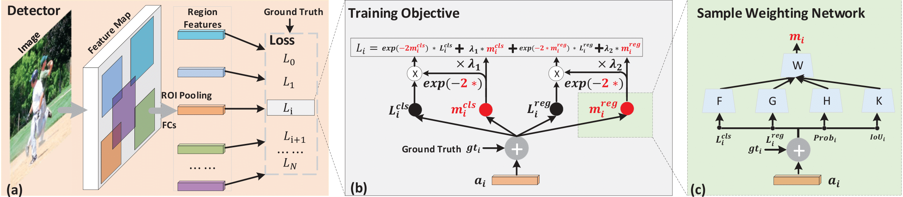

# Learning a Unified Sample Weighting Network for Object Detection
This is the implementation of '**Learning a Unified Sample Weighting Network for Object Detection**' [CVPR 2020]. The original paper can be found [here](http://openaccess.thecvf.com/content_CVPR_2020/papers/Cai_Learning_a_Unified_Sample_Weighting_Network_for_Object_Detection_CVPR_2020_paper.pdf).



## Usage
a. Following [MMDetection](https://github.com/open-mmlab/mmdetection) for installing pre-requirements.

b. clone this repo and build. 
```shell
git clone https://github.com/caiqi/sample-weighting-network
cd sample-weighting-network
python setup.py develop
```
c. Prepare COCO dataset.

It is recommended to symlink the dataset root to `sample-weighting-network/data`.

```
sample-weighting-network
├── mmdet
├── tools
├── configs
├── data
│   ├── coco
│   │   ├── annotations
│   │   ├── train2017
│   │   ├── val2017
│   │   ├── test2017
│   ├── VOCdevkit
│   │   ├── VOC2007
│   │   ├── VOC2012

```

d. Train Faster R-CNN/Mask-RCNN/RetinaNet with ResNet-50/ResNet-101 backbones:

```Shell
    bash scritps/[Faster/Mask/Retina]_[R50/R101].sh
```

## Citation
If you find this code or model useful for your research, please cite our paper:

    @inproceedings{cai2020learning,
      title={Learning a Unified Sample Weighting Network for Object Detection},
      author={Cai, Qi and Pan, Yingwei and Wang, Yu and Liu, Jingen and Yao, Ting and Mei, Tao},
      booktitle={Proceedings of the IEEE Conference on Computer Vision and Pattern Recognition},
      year={2020}
    }


## Acknowledgements
Thanks the contribution of [MMDetection](https://github.com/open-mmlab/mmdetection) and awesome PyTorch team.
